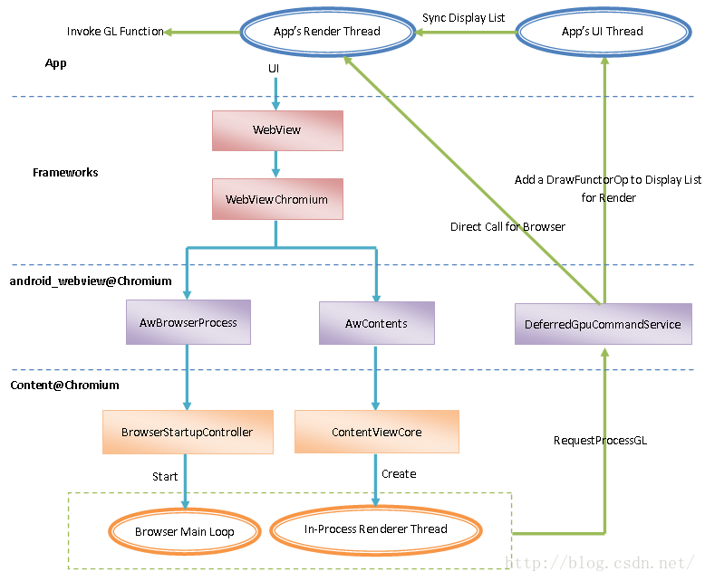

# ChromiumWebView

Android WebView implementation using the Chromium WebView provider. 
The codes include java codes about WebView in aosp and about android_webview in chromium. 
The following shows the architecture of Chromium WebView.

